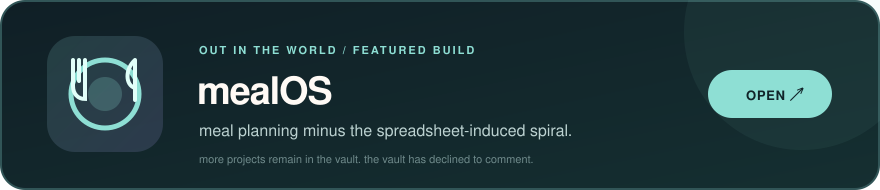

  
    
  
  

 

 

  <h3>the legally-approved stalking zone 🕵️</h3>
  
books, films, and music — all the evidence, neatly arranged.

  
    last signal received
    <!-- PROFILE-LAST-UPDATED:START -->
    <relative-time datetime="2026-09-13T03:16:51.845Z">a few seconds ago</relative-time>
    <!-- PROFILE-LAST-UPDATED:END -->
  

 

<table>
  <tr>
    <td width="50%" valign="top">
      
    </td>
    <td width="50%" valign="top">
      
    </td>
  </tr>
  <tr>
    <td colspan="2">
      
    </td>
  </tr>
</table>

 

  
   
  
  
  
    
  look around. just don't make it weird.

