  

 

i make things for the web. some of them escape the vault.

### ⋆｡°✩ out in the world

↳ **[mealOS](https://mealos.hnitch.workers.dev)** — meal planning minus the spreadsheet-induced spiral 
↳ *(the rest are still classified, sorry)*

### ⋆｡°✩ the current rotation

<table>
  <tr>
    <td width="50%" valign="top">
      
    </td>
    <td width="50%" valign="top">
      
    </td>
  </tr>
  <tr>
    <td colspan="2">
      
    </td>
  </tr>
</table>

  these update themselves — tiny robots are nosy so you don't have to be
    
  <a href="https://www.goodreads.com/user/show/178629903">goodreads</a>
  &nbsp;·&nbsp;
  <a href="https://letterboxd.com/hnitch/">letterboxd</a>
  &nbsp;·&nbsp;
  <a href="https://discord.com/users/690729789702537336">discord</a>
    
  

